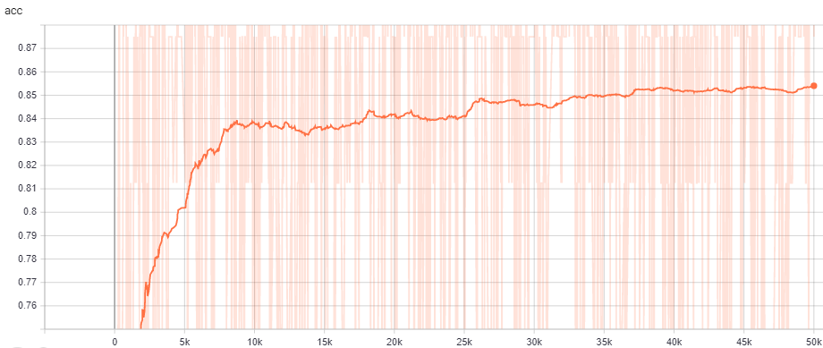
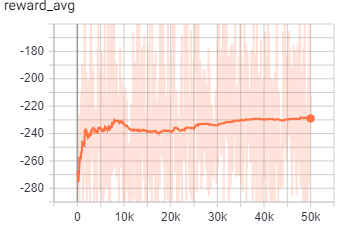
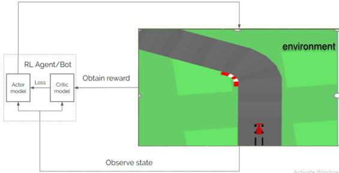
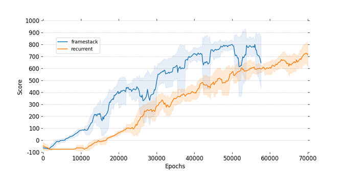
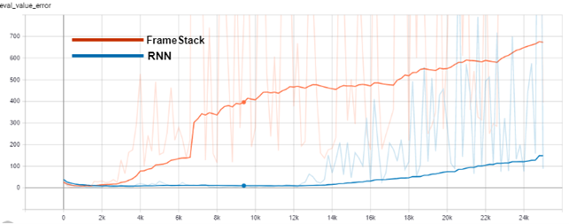

# Deep Reinforcement Learning based Autonomous Driving Agents


## About the Project
The main objective of this thesis is to provide a comprehensive analysis of current approaches for training autonomous vehicle agents using deep reinforcement learning (DRL). And our key contribution is to present two working implementations of DRL algorithms. First, we present a Deep Q-Network (DQN)-based agent capable of reliably learning to drive in the CARLA urban driving simulator. Second, Proximal Policy Optimization (PPO) to teach an agent to drive in a driving-like environment (CarRacing-v0)

## DRL deep-Q-Network in CARLA 

The implementation was written in Python 3.7 and TensorFlow 1.14 with Keras 2.2.4.
[CALRA](https://github.com/carla-simulator/carla/releases) version 0.9.4 town03
The code configuration and setup Carla was done on my own PC using PyCharm the training process was carried out on a Linux which was running Ubuntu version 20.4 supported with GPU, the connection was done remotely by OpenVPN and PuTTY.

the code below describe how to Spawn the car agent(client) of type tesla model3 in CARLA town3 at position 2.5 forward and 0.7 up with a RGB camera sensor to interact with the environment(server)
   

```ruby
IM_WIDTH = 640
IM_HEIGHT = 480
actor_list = []
collision_hist = []
try:
# connect to client
client = carla.Client('localhost', 2000)
client.set_timeout(2.0)
world = client.get_world()
blueprint_library = world.get_blueprint_library()
#filter a vehicle of type tesla model3
bp = blueprint_library.filter('model3')[0]
print(bp)
#pick a spawn point randomly
spawn_point = random.choice(world.get_map().get_spawn_points())
#spawn the car
vehicle = world.spawn_actor(bp, spawn_point)
#control the car
vehicle.apply_control(carla.VehicleControl(throttle=1.0, steer=0.0))
#add the vehicle to our list of actors that we need to track
actor_list.append(vehicle)
# get the blueprint for this sensor, spawn location
blueprint = blueprint_library.find('sensor.camera.rgb')
# change the dimensions of the image
blueprint.set_attribute('image_size_x', f'{IM_WIDTH}')
blueprint.set_attribute('image_size_y', f'{IM_HEIGHT}')
blueprint.set_attribute('fov', '110')
# Adjust sensor relative to vehicle
spawn_point = carla.Transform(carla.Location(x=2.5, z=0.7))
# spawn the sensor and attach to vehicle.
sensor = world.spawn_actor(blueprint, spawn_point, attach_to=vehicle)
# add sensor to list of actors
actor_list.append(sensor)
```
### DQN model
I choose the model 64x3 CNN consist of 3 convolutional layer and kernel size 3x3, I didn't add more layer to avoid overfitting. In RL its difficult to train an agent with tens millions of parameters. where the 64x3 CNN gives the best performing.
the code below describe creating the model:
```ruby
 model = Sequential()

        model.add(Conv2D(64, (3, 3), input_shape=(IM_HEIGHT, IM_WIDTH,3), padding='same'))
        model.add(Activation('relu'))
        model.add(AveragePooling2D(pool_size=(5, 5), strides=(3, 3), padding='same'))

        model.add(Conv2D(64, (3, 3), padding='same'))
        model.add(Activation('relu'))
        model.add(AveragePooling2D(pool_size=(5, 5), strides=(3, 3), padding='same'))

        model.add(Conv2D(64, (3, 3), padding='same'))
        model.add(Activation('relu'))
        model.add(AveragePooling2D(pool_size=(5, 5), strides=(3, 3), padding='same'))

        model.add(Flatten())

        model.add(Dense(3, activation="linear"))
        model = Model(inputs=model.input, outputs=model.output)
        model.compile(loss="mse", optimizer=Adam(lr=0.001), metrics=["accuracy"])
```	
to run the script for training model:
```
#Run Carla
CarlaUE4.exe town03 -ResX=30 -ResY=30
```


open another terminal
```
Python train.py
```
The model was train for 8 days 50000 epsiode.<br />
in the folder `models/` you can find a pretrained model `FinalModel.hdf5` trained for 10000 epsiode.

### Results 


<br />

<br />
For further information, description of the code and the process steps, Go to page 38 of the PDF folder and read section 5


#### For testing the model we run the command:

```
Python test.py
```
the test result: [Output_command](https://drive.google.com/file/d/1236lOgR6en0iUBRHgOF8gNQCZhxrZHpT/view?usp=sharing)
<br />
[media_1](https://drive.google.com/file/d/10Pf8d4lsIToUAsdLxzxxKEu-uf150flx/view?usp=sharing)

## Proximal Policy Optimization(PPO)in Driving-Like Environment
The implementation was written in Python 3.7 with TensorFlow 1.18. Install the OpenAI gym library developed by Python [here](https://github.com/elsheikh21/car-racing-ppo/blob/master/docs/how-to-get-started.md).
<br />
The reasons for choosing CarRacing-v0 gym environment that it doesn’t require high GPU and high video memory, it was suitable with the low PC capability.
<br />

### (PPO)Architecture


<br />
- PPO function by collecting a batch of experiences from interacting with the environment and using those batches to update the agent policy
- The actor model performs the task of learning what action to do under the observed state
- The critic model receives the reward of the pervious action and evaluate the action done by the actor model by generating a numeric value `(𝐴_𝑡 )`

### Train the models
The training process was done on two models:
- the `Frame Stack model Model` consist of 4 input frames
- The `Recurrent model` merged the latent features space vector `ϕ_(t-1)` from the last step with the current latent features `ϕ_t`, doubled the number of parameters in our fully connected layers.
 <br />
Command for training:

```
#FrameStack Model
Python FrameStack_Model.py --model_name ppo_framestack
```
<br />
```
#Recurrent Model
Python Recurrent_Model.py --model_name ppo_rnn
```
### Results
During training, the evaluation was running every 200 epochs

`Cumulative reward of the models over number of epochs`



`Evaluation of error value for the models`


<br />
The frame-stack model achieves highest score than the recurrent model, a score of 800 on its best run [here](https://drive.google.com/file/d/1tFTvriW2qdVt3ORoHqJE3R7rjWErx3yd/view?usp=sharing).
<br />
The recurrent model has less variance in its performance measurements compared to the frame stack model.  The ability to maintain a low level of variation throughout training and testing is a highly desired characteristic, and it is a very significant characteristic when it comes to training self-driving cars